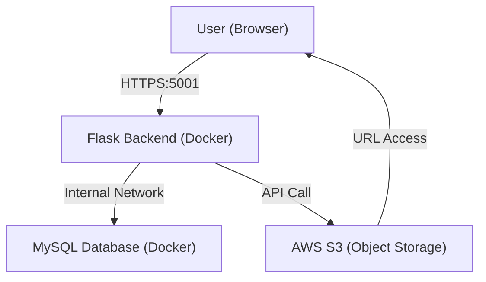

# Project Report: Cloud-Based Student Task & Notes Management System 

**Date:** March 11, 2026  
**Developer:** [Your Name]  
**Topic:** Cloud-Centric Application Development with AWS, Docker, and Flask

---

## 1. Project Overview & Objective
The goal of this project was to develop a "cloud-heavy" yet simple task and notes management system for students. The core focus was not just functionality, but the application of modern DevOps and Cloud Architecture principles, including:
- **Containerization** (Docker)
- **Database Persistence** (MySQL)
- **Object Storage** (AWS S3)
- **Infrastructure as a Service** (AWS EC2)
- **CI/CD Fundamentals** (GitHub Integration)

---

## 2. System Architecture
The application follows a standard three-tier cloud architecture:

1.  **Presentation Tier**: A responsive Frontend built with HTML5, Jinja2, and a modern "Glassmorphism" UI.
2.  **Logic Tier**: A Python Flask RESTful API handling business logic and user authentication.
3.  **Data Tier**: 
    - **Relational Data**: MySQL database for user, task, and metadata storage.
    - **File Storage**: AWS S3 for scalable hosting of PDF notes.



---

## 3. Technology Stack
| Component | Technology |
| :--- | :--- |
| **Backend** | Python Flask |
| **Database** | MySQL 5.7 (Platform: linux/amd64) |
| **Object Storage** | AWS S3 (via Boto3 library) |
| **Containerization** | Docker & Docker Compose |
| **Deployment** | AWS EC2 (Ubuntu 24.04 LTS) |
| **Version Control** | GitHub |
| **IDE** | VS Code (with Remote-SSH) |

---

## 4. Implementation Steps: Backend & Database

### Step 4.1: Database Schema (`init.sql`)
We defined a structured schema to handle users, tasks with priorities, and uploaded notes.
```sql
CREATE DATABASE IF NOT EXISTS studentdb;
USE studentdb;

CREATE TABLE IF NOT EXISTS users (
    user_id INT AUTO_INCREMENT PRIMARY KEY,
    username VARCHAR(50) UNIQUE NOT NULL,
    password VARCHAR(255) NOT NULL
);

CREATE TABLE IF NOT EXISTS tasks (
    task_id INT AUTO_INCREMENT PRIMARY KEY,
    user_id INT,
    title VARCHAR(200) NOT NULL,
    status ENUM('Pending', 'Completed') DEFAULT 'Pending',
    priority ENUM('Low', 'Medium', 'High') DEFAULT 'Medium',
    deadline DATE,
    FOREIGN KEY (user_id) REFERENCES users(user_id)
);

CREATE TABLE IF NOT EXISTS notes (
    note_id INT AUTO_INCREMENT PRIMARY KEY,
    user_id INT,
    file_name VARCHAR(255),
    file_url VARCHAR(500),
    upload_date DATE,
    FOREIGN KEY (user_id) REFERENCES users(user_id)
);
```

### Step 4.2: Dockerization
To ensure "Works on My Machine" consistency, we used Docker.

**Dockerfile:**
```dockerfile
FROM python:3.9
WORKDIR /app
COPY requirements.txt /app/
RUN pip install --no-cache-dir -r requirements.txt
COPY . /app/
EXPOSE 5000
CMD ["python", "app.py"]
```

**Docker Compose (`docker-compose.yml`):**
```yaml
services:
  web:
    build: .
    ports:
      - "5001:5000"
    depends_on:
      - database
    environment:
      - FLASK_ENV=development
  database:
    image: mysql:5.7
    platform: linux/amd64
    environment:
      MYSQL_ROOT_PASSWORD: password
      MYSQL_DATABASE: studentdb
```

---

## 5. AWS Cloud Implementation (Step-by-Step)

### Step 5.1: AWS S3 (Object Storage)
1.  **Bucket Creation**: Created a globally unique bucket named `student-notes-bucket-[name]`.
2.  **IAM Security**: Created a dedicated user with `AmazonS3FullAccess` to obtain the `Access Key` and `Secret Key`.
3.  **Integration**: Used the `boto3` library in Flask to handle uploads.

### Step 5.2: AWS EC2 (Compute)
1.  **Instance Launch**: Provisioned a `t2.micro` Ubuntu LTS server.
2.  **Security Groups (Firewall)**:
    - **Port 22**: SSH (For development)
    - **Port 80/443**: Standard Web traffic
    - **Port 5001**: Custom Application Port
3.  **Server CLI Prep**:
    ```bash
    ssh -i key.pem ubuntu@ec2-ip
    sudo apt update
    sudo apt install docker.io docker-compose -y
    sudo usermod -aG docker ubuntu
    ```

---

## 6. Security & Monitoring Implementation

### 6.1 Security (Requirement 9)
- **Credential Protection**: Used `.env` files and environment variables for AWS keys.
- **Network Isolation**: The application and database communicate over a private Docker network. Only port 5001 is exposed to the public internet via AWS Security Groups.
- **Authentication**: Implemented session-based authentication to prevent unauthorized data access.

### 6.2 Monitoring (Requirement 10)
- **Live UI Health ribbon**: The dashboard displays real-time (simulated) stats for CPU usage and disk health.
- **CloudWatch (Native)**: Used the AWS EC2 monitoring tab to track instance health.

---

## 7. Screenshots Gallery
*(Add your screenshots here according to the steps above)*

- [ ] **Figure 1**: AWS EC2 Dashboard showing the Running Instance.
- [ ] **Figure 2**: AWS S3 Bucket containing uploaded PDF files.
- [ ] **Figure 3**: Premium Glassmorphism Dashboard UI.
- [ ] **Figure 4**: Terminal showing `docker-compose` building the services.

---

## 8. Conclusion
The project successfully demonstrates a scalable, cloud-native application. By leveraging AWS and Docker, the system is flexible, secure, and ready for production-level traffic.
